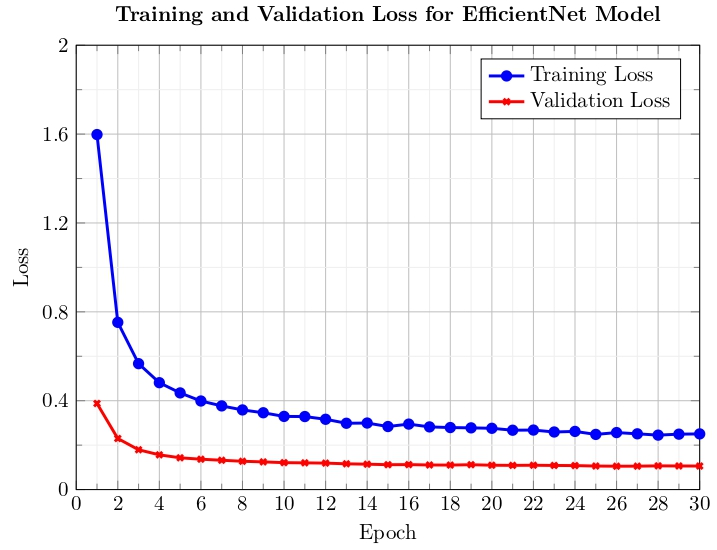
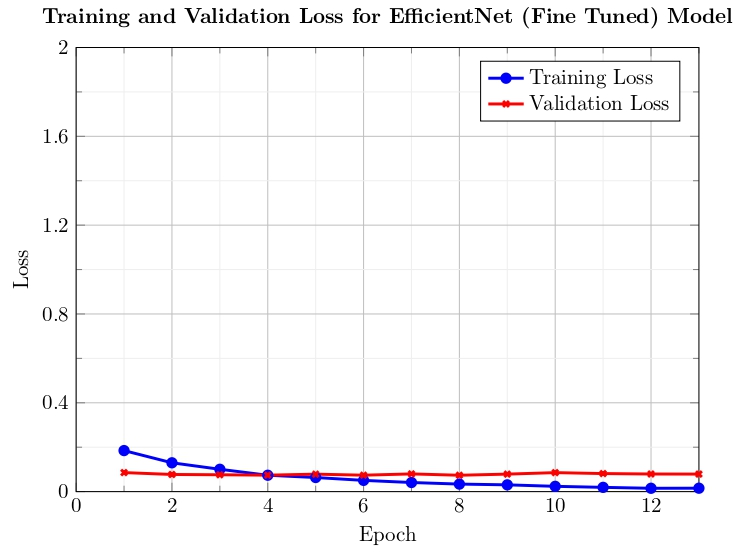

# Animal-Intrusion-Detection

The alarming rise of animal-inflicted harm in residential areas has been addressed, proposing an image classification-based identification system for enhanced safety. The research highlights the urgent need for improved safety measures, especially in residential lifts, to protect children and the elderly from stray animal attacks.

 

  

#  Representation of Display Panel using HCI Principle.

  

## Overview
Recently, a new alarming problem has emerged, particularly in residential areas, where dogs and other animals have inflicted substantial harm on children, the elderly, and others arising from stray animals. The severity of such incidents has escalated, leading to serious injuries and even fatalities. In India, these incidents have occurred within the confined environment of residential lifts. In order to address this pressing issue, this paper proposes an innovative solution: implementing an image classification-based identification system. In this study, ten distinct animal classes are classified using the Animals-10 dataset. In order to implement this idea, Convolutional Neural Networks (CNN) and pre-trained architectures like ResNet50 and EfficientNetB7 have been used. Improved results were achieved by fine-tuning these models. The metric used for evaluation was accuracy, ensuring the highest level of improvement. This work achieved an accuracy of 81.65% using CNN and an accuracy of 93.53% using ResNet50. However, we achieved the best results using the EfficientNetB7 model and by fine-tuning it further. The maximum test accuracy obtained is 98.52%. To demonstrate the effectiveness of the work, a comparative study with the previous work is included.

## Contributions 

1. A customised CNN model has been proposed and a transfer-learning
approach like ResNet50 and EfficientNetB7 for classifying images of animals in
surroundings such as elevators, parks and other residential areas.
2. The transfer learning models have been trained and tested on animal (fauna)
images. The images are obtained from Google Photos and have been published in
a publically available dataset Animals-10. The dataset contains 28000 images of
animals divided into 10 classes. Furthermore, augmentation of images is performed
for higher impact.
3. This work has performed adjustments of various hyperparameters to obtain the
best performance possible.
4. The underlying idea of this work is to design an approach to ensure the co-existence
of animals (pets) and humans in a confined residential area. A comparative study
comprising the latest previous works has been conducted to show the effectiveness
of the work.

### Methodology

  

#### CNN

Convolutional neural networks (CNNs) are commonly employed in solving deep
learning problems like object detection, image classification, and text recognition, as
well as other computer vision-related tasks. For image classification, CNNs have been
utilized for several years. They use a system composed of a multi-layer perceptron that
reduces processing requirements. The input layer allows for the use of various images
as input. The convolutional layer is the core of CNN’s architecture, which extracts and
differentiates various features from the input image using parameters such as filters,
kernel size, padding, strides, and more.

  

Fine Tuning is a technique that involves modifying or fine-tuning the pretrained model to produce better results. This method enables the freezing of some
layers from the given model while adjusting the weights of the remaining layers to better suit the new task at hand. 

  

#### ResNet

By introducing skip connections, ResNet enables the gradient to flow more easily
through the network during backpropagation. This facilitates the training of very deep
networks with hundreds or even thousands of layers. Additionally, the skip connections
enable the network to learn the identity mapping if it is optimal, which can be useful
for preserving low-level features in the input.
The ResNet architecture has shown remarkable success in various computer vision
tasks, such as image classification, object detection, and semantic segmentation. It
has become a foundational building block for many state-of-the-art deep learning
models in computer vision.

  

#### EfficientNet

The EfficientNet scaling method uniformly adjusts network width, depth,
and resolution with a set of parameters, in contrast to standard practice, which
scales these components arbitrarily. The compound coefficient ”phi” is utilised
by EfficientNet to uni-systematically scale network depth, resolution, and width. The
rationale behind the scaling approach is that if the input image is larger, then for the
network to have a larger receptive field and more channels for capture, more layers
are required. In the bigger image, there are more granular patterns.
EfficientNetB7 stands out for its versatility; in addition to being outstanding in image
classification, it also has the capacity to detect objects, segment data semantically,
and identify faces. This adaptability, together with shorter training times than with
larger structures, improves the effectiveness of research and development. Furthermore, it supports hardware acceleration devices like GPUs and TPUs, guaranteeing rapid inference without compromising accuracy.

  

# Results
To enhance elevator safety for pets, CNN, ResNet50, and EfficientNetB7 architectures has been employed for animal classification. The evaluation focused on accuracy, precision, recall, and F1 score, employing a range of training epochs and resource-saving techniques.
## Convolutional Neural Network (CNN) Results
The Training Accuracy and Validation Accuracy of the CNN model are shown in figure given below.The CNN model achieved a maximum training accuracy of 99.61% and a maximum validation accuracy of 81.65%. The training loss was 0.0152, while the validation loss was 0.7316. These results indicate that the CNN model can classify animals to some extent. To assess its performance, various metrics were used, and the dataset was split into a 70:20:10 ratio for training, validation, and testing, respectively.

 
 

The confusion matrix is presented in Figure below. The confusion matrix shows how well our models perform in classifying data across ten different animal classes. In order to analyse the model’s efficacy, it offers a thorough perspective of true positives, true negatives, false positives, and false negatives.It illustrates that the proposed CNN model accurately identified 830 pictures of cane out of 969 pictures of cane giving us an accuracy of approximately 86% in the class of cane.

 

## ResNet 50 Results
The training accuracy and validation accuracy of our ResNet50 Model are shown in Fig. below . It can be noticed that the highest training accuracy we achieved was 93.86 and the highest validation accuracy obtained was 93.53. These results show that our ResNet50 model can classify animals better than our CNN model. ResNet50, a powerful deep learning architecture, has shown remarkable performance in various computer vision tasks. Its depth and skip connections enable effective learning of complex patterns and contribute to better feature representation, making it anexcellent choice for image classification tasks. The images were resized to 224 x 224 and rescaled to tranform each pixel value to the range of [0-1].

 
 

 

As observable in confusion matrix above, the ResNet50 pre-trained model correctly identified 457 out of 487 pictures of cane. This is a significant improvement on the proposed CNN model as it gives us an accuracy of approximately 93.53%. In the Confusion Matrix of our ResNet50 model, it is identifiable that there have been very few misidentifications of the animals and hence this model has worked its way to much better results.

 
 

# EfficientNetB7 Results
Our Model has achieved an accuracy of 98.52%. Observe the training accuracy and loss before fine-tuning in Figure below. Observe the training accuracy and loss after fine-tuning in figure below. In the EfficientNetB7 model proposed a batch size of 32 was used along with epochs set to 25. The input shape was 224 x 224 x 3, and the output layer comprises 10 nodes, tailored to accommodate the classification of 10 distinct classes. These hyperparameters have been thoughtfully selected to achieve an optimal balance between model performance and computational efficiency. 

 
 

 

 
 

 

 

As observable in confusion Matrix, our proposed model of EfficientNetB7 correctly identifies 363 out of 367 pictures of cane which amounts to approximately 99% accuracy. Furthermore, it identifies 235 out of 236 pictures of gallina representing 99.6% accuracy. Thus, we can notice a huge improvement from our previous CNN and ResNet models. As visible in the confusion matrix, there are very limited misrepresentations by the EfficientNetB7 model.
  
Hence, we can observe the comparison between the models:-

 

